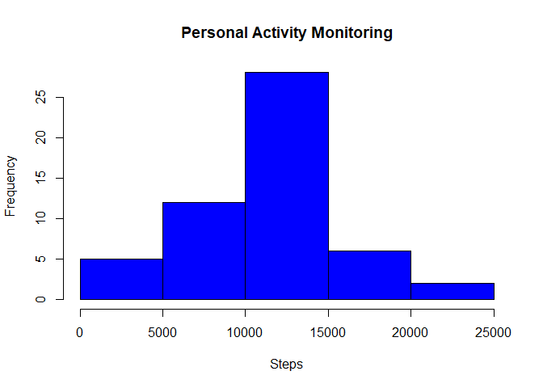
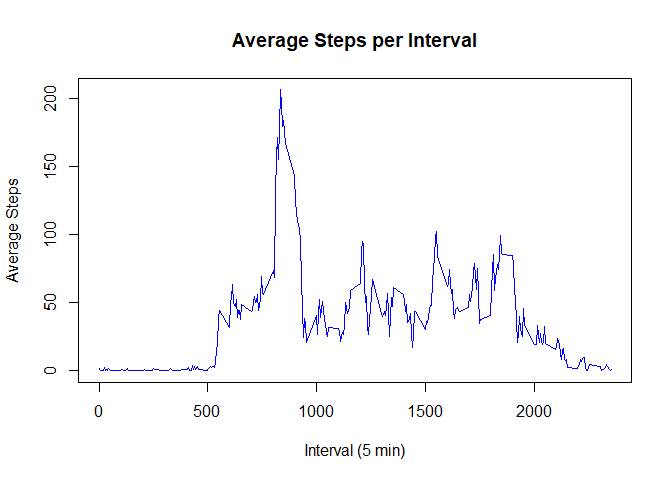
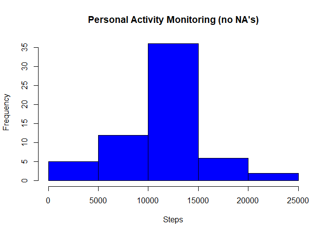
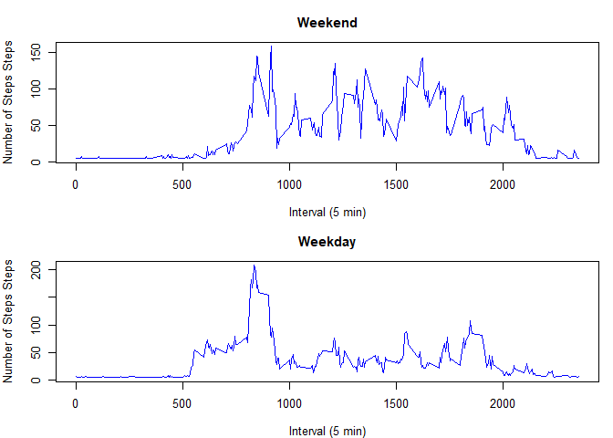

## Loading and preprocessing the data

The following code reads personal movement data from the
file "activity.csv", aggregates the steps by date, and 
displays a histogram of the steps per day.


```r
  activitydata<-read.csv("activity.csv")
  
  activitydata$date<-as.Date(activitydata$date)
  activityaggregate<-aggregate(activitydata["steps"], by=activitydata["date"], sum)  

  stepsaggregate<-activityaggregate$steps
  
  hist(stepsaggregate,
       main="Personal Activity Monitoring",
       ylab="Frequency",
       xlab="Steps",
       col="blue",breaks=5)
```

<!-- -->
  

## What is mean total number of steps taken per day?

The following code calculates the mean and median of
the aggregate of steps and displays the values.


```r
  meansteps<-mean(stepsaggregate,na.rm=TRUE)
  mediansteps<-median(stepsaggregate,na.rm=TRUE)
  
  cat(sprintf("mean steps per day = %.2f\n",meansteps))
```

```
## mean steps per day = 10766.19
```

```r
  cat(sprintf("median steps per day = %.2f\n",mediansteps))
```

```
## median steps per day = 10765.00
```
  

## What is the average daily activity pattern?

The following code calculates a daily activity pattern from the 
data, plots average steps per interval, plots the results, and
determines the interval with the maximum steps.


```r
  daily_activity_pattern <- tapply(activitydata$steps, activitydata$interval, mean, na.rm = TRUE)
  
  plot(row.names(daily_activity_pattern),daily_activity_pattern,
       main="Average Steps per Interval", 
       ylab="Average Steps",
       xlab="Interval (5 min)",
       type="l",col="blue")
```

<!-- -->

```r
  maxindex<-which.max(daily_activity_pattern)
  maxinterval<-activitydata$interval[maxindex]

  cat(sprintf("Interval %i contains the maximum number of steps\n",maxinterval))
```

```
## Interval 835 contains the maximum number of steps
```
  
  
## Inputing missing values

The following code counts the number of missing values in 
the data, replaces the missing data with the mean value
from the entire dataset, plots a histogram of the dataset
with filled in values, and calculates the mean and median
values of the new dataset.


```r
  missingcount<-sum(is.na(activitydata$steps))

  cat(sprintf("Total number of missing values in the dataset = %i\n",missingcount))
```

```
## Total number of missing values in the dataset = 2304
```

```r
  for (i in 1:nrow(activitydata)) {

    if (is.na(activitydata$steps[i])) {
      activitydata$steps[i]<-as.integer(meansteps/288)
    }

  }

  activityaggregate<-aggregate(activitydata["steps"], by=activitydata["date"], sum)  

  stepsaggregate<-activityaggregate$steps
  
  hist(stepsaggregate,
       main="Personal Activity Monitoring (no NA's)",
       ylab="Frequency",
       xlab="Steps",
       col="blue",breaks=5)
```

<!-- -->

```r
  meansteps2<-mean(stepsaggregate,na.rm=TRUE)
  mediansteps2<-median(stepsaggregate,na.rm=TRUE)
  
  cat(sprintf("mean steps per day (no NA's) = %.2f vs. %.2f (with NA's)\n",meansteps2,meansteps))
```

```
## mean steps per day (no NA's) = 10751.74 vs. 10766.19 (with NA's)
```

```r
  cat(sprintf("median steps per day (no NA's) = %.2f vs. %.2f (with NA's)\n",mediansteps2,mediansteps))
```

```
## median steps per day (no NA's) = 10656.00 vs. 10765.00 (with NA's)
```
  

## Are there differences in activity patterns between weekdays and weekends?

The following code determines which days are weekdays, which are weekends,
and adds a column to the dataset indicating weekday / weekend.  A panel plot
is then created showing data for weekend and weekday separately. 


```r
  myweekdays<-weekdays(activitydata$date)

  daytype<-data.frame()
  
  if ((myweekdays[1]=="Saturday") || (myweekdays[1]=="Sunday")) {
    daytype<-cbind("weekend")
  } else {
    daytype<-cbind("weekday")
  }

  for (i in 2:length(myweekdays)) {
    if ((myweekdays[i]=="Saturday") || (myweekdays[i]=="Sunday")) {
      daytype<-rbind(daytype,as.character("weekend"))
    } else {
      daytype<-rbind(daytype,as.character("weekday"))
    }
  }
  
  activitydata<-cbind(activitydata,daytype)
  
  daysteps<-aggregate(steps~interval+daytype,data=activitydata,mean)
  
  weekdaysteps<-subset(daysteps,daysteps$daytype=="weekday")
  weekendsteps<-subset(daysteps,daysteps$daytype=="weekend")
  
  par(mfrow=c(2,1))
  par(cex = 0.8)
  par(mar = c(4, 4, 3, 1))
  
  plot(weekendsteps$interval,weekendsteps$steps,
       main="Weekend", 
       ylab="Number of Steps Steps",
       xlab="Interval (5 min)",
       type="l",col="blue")
  
  plot(weekdaysteps$interval,weekdaysteps$steps,
       main="Weekday", 
       ylab="Number of Steps Steps",
       xlab="Interval (5 min)",
       type="l",col="blue")
```

<!-- -->
  
There is a difference between weekend and weekday activity.
